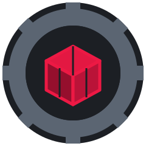
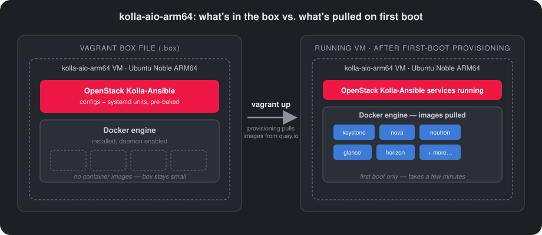

<p align="center"></p>

## Description
A Vagrant box for trying Kolla OpenStack all-in-one through Vagrant on Ubuntu 24 ARM with the VMware Fusion provider (for now...).

<p align="center"></p>

For installing OpenStack, I followed the Kolla Ansible quickstart at https://docs.openstack.org/kolla-ansible/2026.1/user/quickstart.html#install-kolla-ansible. The base box I used was https://portal.cloud.hashicorp.com/vagrant/discover/gyptazy/ubuntu24.04-server-arm64 (thank you, gyptazy!).

I built the images directly into the box using the following command. Change the regex to specify which component you want to build:

```bash
kolla-build -b ubuntu --openstack-release 2026.1 --tag 2026.1-ubuntu-noble-aarch64 '^(nova).*'
```

### Docker images not included in the box, pulled on first boot

To keep the box size down, this Vagrant box is distributed **without** the Kolla Docker images pre-pulled. On first boot, Docker will pull all the Kolla container images from the registry, so the `kolla-*-container` services may take a few minutes to become healthy the first time. A banner reminding you of this is shown on every SSH login.

### Supported OpenStack version

This project supports OpenStack **2026.1**.

### Skyline Console

- URL: http://192.168.50.10:9999/
- Credentials: /etc/kolla/admin-openrc.sh

### Why VMware Fusion specifically, in this case

On Apple Silicon, the choice is more practical than ideological:

- **VirtualBox**: ARM64/Apple Silicon support is still immature.
- **UTM/QEMU** (this one *is* open source): works, but with a different virtualization overhead, less mature for "heavy" workloads like an OpenStack AIO with nested networking.
- **VMware Fusion**: native hardware virtualization on Apple Silicon is very mature, with better performance for a workload like Kolla-Ansible with all the OpenStack containers.

So the choice is pragmatic: the part that matters (OpenStack) stays open source and reproducible, while the hypervisor is chosen for stability/performance on this specific hardware, not for its license.